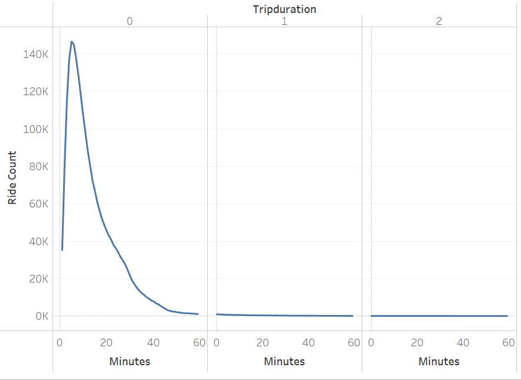
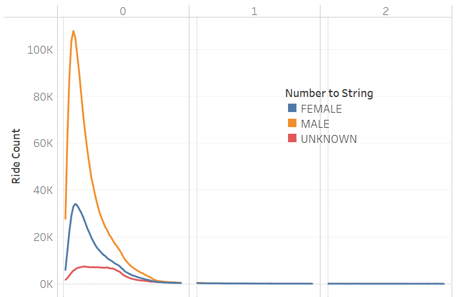

# Bikesharing

## Overview
This project is to provide analysis of NYC's Citibike data for potential investors in a Des Moines bikesharing startup.

## Resources
Data Source: https://s3.amazonaws.com/tripdata/JC-201908-citibike-tripdata.csv.zip

Software: Tableau Public v. 022.4.0, Python with Pandas library and Jupyter Notebook, Visual Studio Code

[Tableau Story](https://public.tableau.com/app/profile/john.mcmillan1659/viz/BikeSharingStory_16747030793770/BikesharingStory?publish=yes)

## Results
Below are images of visualizations using Tableau.

### Checkout Times for Users

- Most trips are quick (less than 20 minutes).
- Almost all trips are less than 40 minutes.

### Checkout Times by Gender

- Trip length by unknown gender users is longer

### Trips by Weekday per Hour

- Here we see that the heaviest usage is during weekday rush hours.
- There is also steady usage throughout the weekend.

### Trips by Gender (Weekday per Hour)

- This illustrates very heavy rush hour usage by males.
- Female usage is steady across commute times and weekends.
- There is more unknown gender usage on weekends.

### User Trips by Gender by Weekday

- The heavy shading indicates that the customer base is predominantly male subscribers.

### Bike Repairs

- Each dot represents a bike.
- The darker and larger dots indicate more usage (number of trips)

### Customers vs. Subscribers

- Most rides are by subscribers.

### Gender Breakdown

- Most rides are taken by males.

## Summary

A large majority of rides take 20 minutes or less. This means the bike is quickly ready for another user. 

Male subscribers who commute make up a large portion of Citibike users in New York City. A bike rental startup could use this type of data for marketing purposes. Additional visualizations that provide exact percentages or ratios would be helpful in this area.

The "Bike Repairs" chart shows that heavily-used bikes can be targeted for more maintenance and repairs. Likewise, costs can be cut by reducing maintenance of the lesser-used bikes. Further analysis could provide the location of the heavily-used bikes. These bikes could perhaps be moved to slower locations for a longer lifespan.
