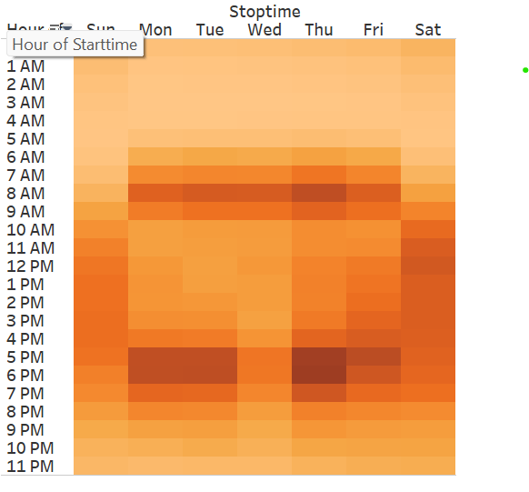
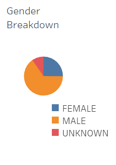

# Bikesharing

## Overview of the analysis
provide analysis of NYC's Citibike data for potential investors in a Des Moines bikesharing startup

### Resources
Data Source: https://s3.amazonaws.com/tripdata/JC-201908-citibike-tripdata.csv.zip
Software: 

## Results
Below are images of visualizations using Tableau

### Checkout Times for Users

- Most trips are short, less than 40 minutes
- almost all less than 40 minutes

### Checkout Times by Gender

- 
- 

### Trips by Weekday per Hour

### Trips by Gender (Weekday per Hour)

### User Trips by Gender by Weekday

### Bike Repairs

### Customers vs. Subscribers

### Gender Breakdown

## Summary
